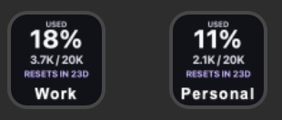

# GitHub Copilot Companion

A local Stream Deck plugin that displays GitHub Copilot AI credits used in the current cycle. It uses Elgato's official Node.js SDK and GitHub CLI credentials; it does not run a cloud service or read Copilot session transcripts.

## Disclaimer

This is an independent project and is not affiliated with, endorsed by, or officially connected with GitHub, Microsoft, or Elgato. GitHub, GitHub Copilot, Stream Deck, Elgato, and related names and marks are trademarks of their respective owners. This plugin uses an undocumented GitHub API endpoint that may change or stop working; use it at your own risk.

## What it shows

Add one **Copilot usage** key per GitHub account. Choose an account saved in GitHub CLI for each key; for example, configure one key for Personal and another for Work. The key makes the percentage of quota used the first thing you see, with used credits / quota and the relative reset countdown beneath it. Large credit totals are compacted on the key; the property inspector retains the exact values, reset time, last update, and any connection or schema errors. Loading, updating, stale, over-limit, and unavailable data have distinct labels, and missing data is never shown as zero.



Set a short, single-line, bottom-aligned native Stream Deck title to distinguish accounts. The key image leaves a clear area for that title. Each visible key refreshes every five minutes; press it to refresh sooner.

Usage is fetched from GitHub's `GET /copilot_internal/user` endpoint. This endpoint is undocumented and may change or stop working. The plugin validates the response and account identity, retains the last successful value as visibly stale when a refresh fails, and never substitutes zero or an estimate.

## Requirements

- Stream Deck app 7.1 or newer and a Stream Deck device
- Node.js 24 or newer
- [GitHub CLI](https://cli.github.com/) 2.81 or newer, authenticated to `github.com` for each account to track

## Set up accounts

Sign in to each GitHub account you want to monitor. Run `gh auth login` once per account; signing in to another account adds it without removing the first:

```sh
gh auth login --hostname github.com --web
# Complete the browser sign-in for the first account, then run the command again
# and complete sign-in for the second account.
gh auth login --hostname github.com --web
gh auth status --hostname github.com
```

In Stream Deck, add a **Copilot usage** action to a key and choose its saved GitHub account in the property inspector. Add another key and select the other account. Set short, bottom-aligned native key titles such as **Personal** and **Work** to distinguish them. If you add another account later, choose **Refresh accounts** in the property inspector. Each key keeps its own explicit selection; changing gh's active account in a terminal does not change either key. The plugin retrieves the selected saved credential with `gh auth token --user <username>` and verifies its identity before reading usage.

Account discovery uses `gh auth status --json hosts`, which requires GitHub CLI 2.81 or newer. Native multi-account authentication and `gh auth token --user` are available in gh 2.40 and newer, but update to 2.81+ to use the account picker. If no accounts appear, run `gh auth status --hostname github.com` in the same user environment as Stream Deck and use **Refresh accounts**. If sign-in status cannot be verified, check your connection and the account-specific status in `gh auth status`. Saved account names are case-insensitive for matching, but the plugin preserves their spelling when reading credentials. Existing manually configured usernames are not cleared when account discovery fails or the saved account is missing.

The plugin looks for `gh` on `PATH` and in standard macOS and Windows install locations. If Stream Deck cannot find a custom installation, set its absolute executable path in **Trusted gh path**. Only use a `gh` executable you trust.

## Privacy and limitations

- Access tokens are read from GitHub CLI's configured credential storage, kept in memory only, and never saved in Stream Deck settings or plugin files. GitHub CLI normally uses the system credential store, but may fall back to plaintext storage if secure storage is unavailable.
- The plugin removes inherited `GH_TOKEN` and `GITHUB_TOKEN` variables when running `gh`, so an environment token cannot silently select a different account.
- Account discovery checks saved account status through GitHub CLI. It does not change the active account, log in, log out, or switch Git credentials.
- The key shows the account quota returned by GitHub; it does not infer a user's share of an enterprise-wide pool or a hard billing cap.
- Documented billing usage reports do not provide the current account quota and reset together, and enterprise reports require billing privileges.
- The property inspector currently loads Elgato's `sdpi-components` library from its CDN, so internet access is required to render the settings UI.

## Build and try it

```sh
npm install
npm test
npm run build
npm run link
npm run watch
```

Keep `npm run watch` running while developing. The plugin is built with the [Stream Deck SDK](https://docs.elgato.com/streamdeck/sdk/introduction/getting-started) and [Stream Deck CLI](https://docs.elgato.com/streamdeck/cli).

For local debugging, temporarily set `Nodejs.Debug` to `enabled` in the plugin manifest. Leave `Nodejs.Debug` unset in release builds.

## Project map

- `src/plugin.ts` registers the usage action and connects to Stream Deck.
- `src/actions/copilot-usage.ts` manages per-key bindings and updates the property inspector.
- `src/copilot/action-bindings.ts` validates settings and isolates per-key account bindings.
- `src/copilot/gh-cli.ts` locates `gh`, discovers saved accounts, and reads the selected credential.
- `src/copilot/github-auth.ts` verifies account identity and caches credentials in memory.
- `src/copilot/http.ts` provides HTTP requests with timeouts.
- `src/copilot/usage-provider.ts` validates Copilot quota responses.
- `src/copilot/usage-store.ts` shares refreshes and polls visible keys.
- `src/copilot/usage-types.ts` defines usage states, snapshots, and errors.
- `src/copilot/render-usage.ts` renders the usage tile.
- `com.ifesenko.github-copilot-companion.sdPlugin/ui/copilot-usage.html` provides account selection and detailed usage status.

## Security

See [SECURITY.md](SECURITY.md) for vulnerability reporting guidance.

## License

This project is licensed under the [MIT License](LICENSE).
